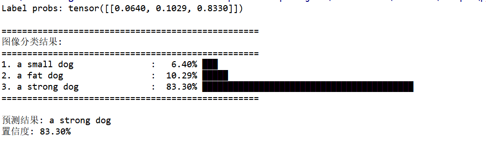
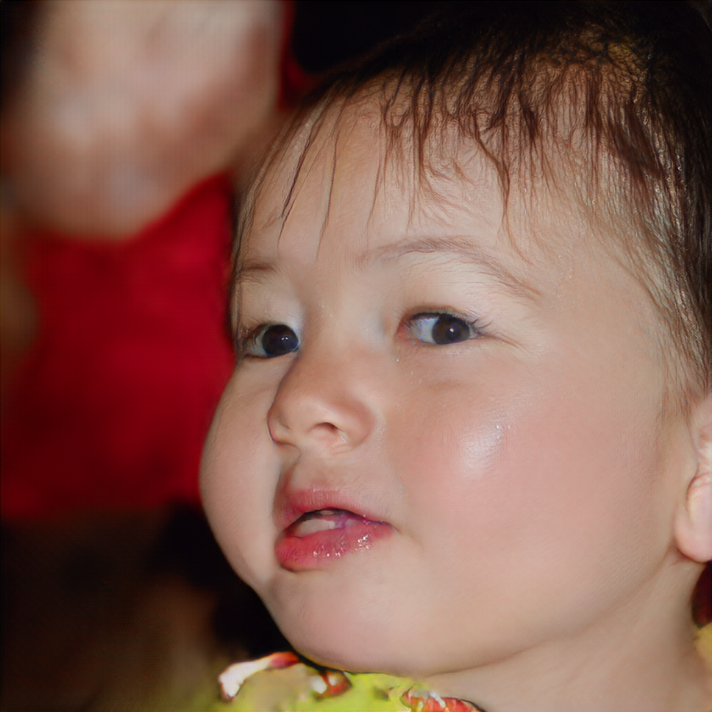
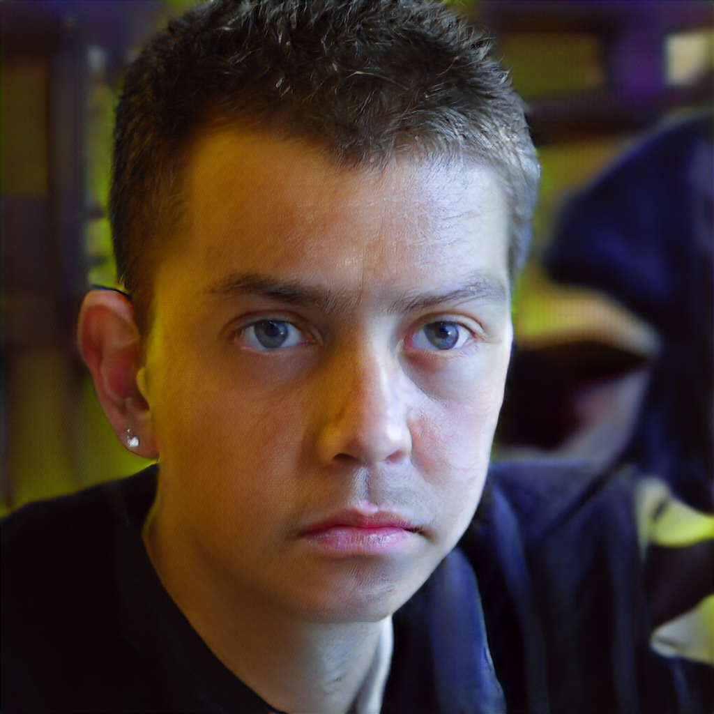
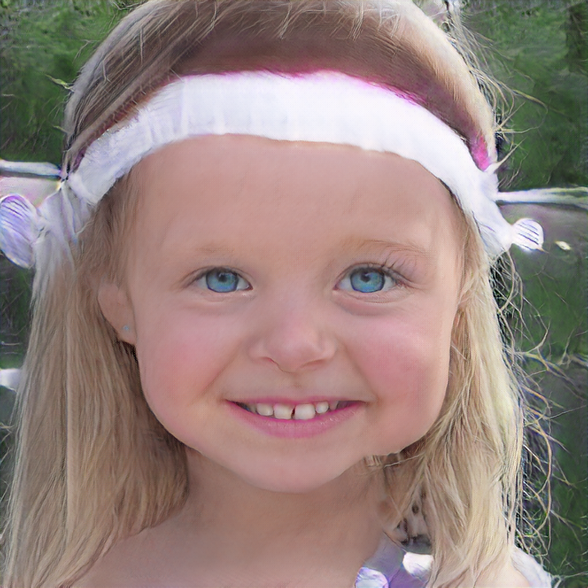
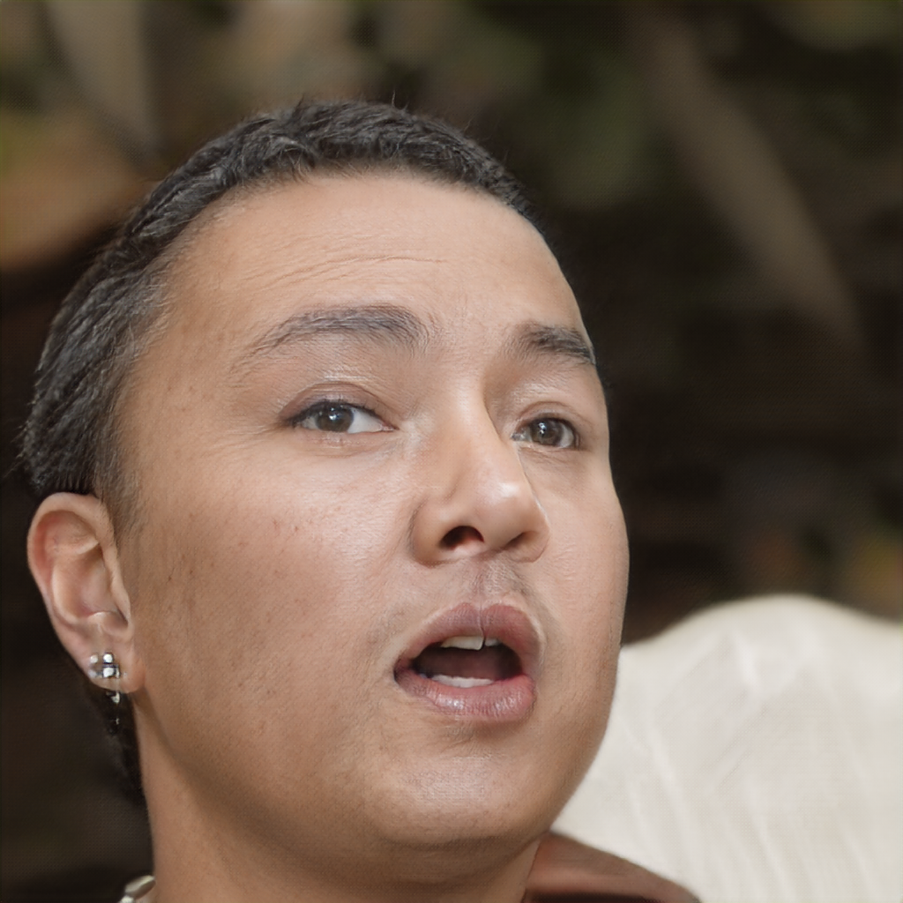
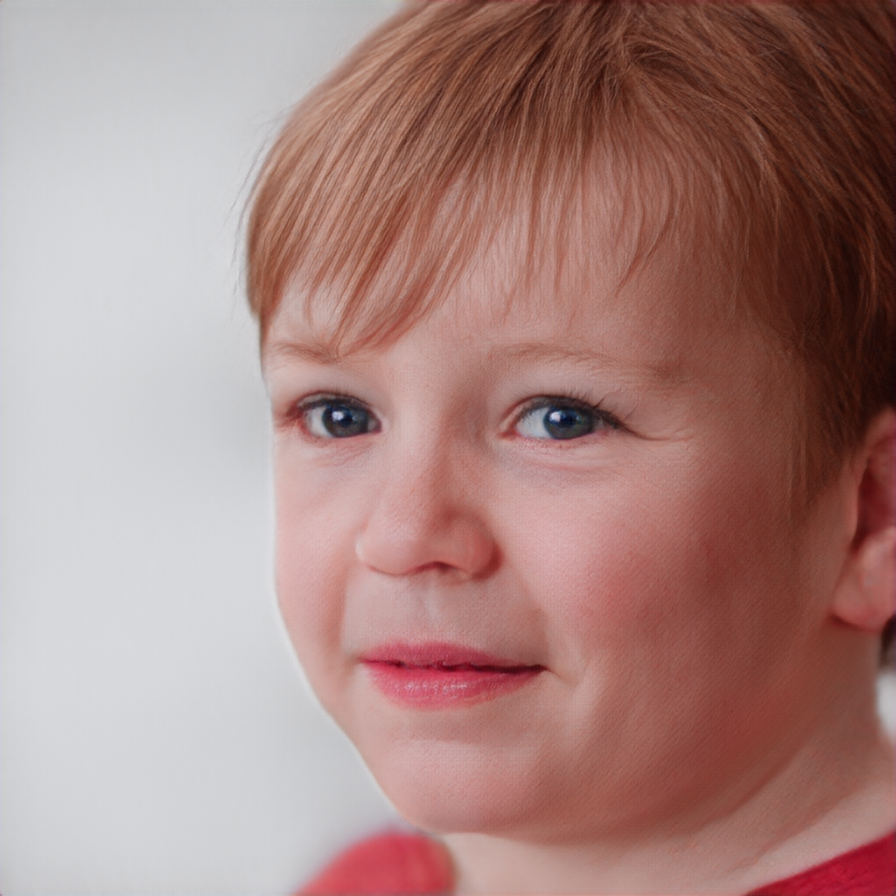

# 项目名称：基于 CLIP 引导的文本生成图像大模型

> **课程**：生成式人工智能  
> **状态**：进行中 / 基础架构搭建  
> **指导老师**：陈培垠  
> **指导老师邮箱**：pychen@hhu.edu.cn  
> **大作业成员邮箱**：134074852@qq.com  

## 1. 项目简介

本项目旨在构建一个**文本到图像Text-to-Image**的生成模型。在文生图任务中，核心挑战在于如何让模型“理解”自然语言描述，并生成与之语义对齐的高保真图像。

为此，我们利用 OpenAI 提出的 **CLIP（Contrastive Language-Image Pre-training）** 模型作为核心语义桥接器。CLIP 通过对比学习，将文本和图像映射到同一个联合嵌入空间（Joint Embedding Space），使得“一只戴帽子的猫”的文本特征与对应的图像特征在空间中的距离拉近。

在本项目中，CLIP 将承担以下关键角色：
1.  **条件引导**：指导生成模型（如 Diffusion GAN 或 Transformer）产生符合文本描述的图像内容。
2.  **语义损失计算**：计算生成图像与目标文本之间的 CLIP 相似度，作为损失函数的一部分。

## 2. 背景动机

传统的文生图模型（如早期的 GANs）常因文本编码器表达能力不足，导致生成图像出现“语义漂移”。CLIP 在大规模图文对（4亿组）上的预训练特性，使其具备强大的零样本（Zero-shot）泛化能力。通过引入 CLIP，我们希望解决：

-   **细粒度对齐**：精确还原文本中的属性（颜色、形状）、数量及关系。
-   **丰富多样性**：利用 CLIP 的泛化能力，生成训练数据中未出现的组合概念。

## 3. 模型架构（概览）

*（待补充：此处将放入整体架构图）*
1. **对比试验**: 
- **使用基本DCGAN网络进行图像生成、CLIP进行引导(CAFE-GAN, RATLIP等)**
  - 具体方案：

- **使用Style-GAN网络进行图像生成、CLIP进行引导（CLIP2GAN）**
  - 具体方案：

- **使用Stable Diffusion网络进行图像生成、CLIP进行引导（ DALL·E 2 、DiffusionCLIP ）**
  - 具体方案：

- **使用Diffusion GAN网络进行图像生成、CLIP进行引导（UFOGen 、clip2latent ）**
  - 具体方案：

- **使用Transformer网络进行图像生成、CLIP进行引导（DALL·E）**
  - 具体方案：

- **使用mobileStyleGAN网络进行图像生成、mobileCLIP网络进行图像引导**
  - 具体方案：  
1、使用预训练mobileStyleGAN进行图像生成，预训练mobileStyleGAN权重获取参考地址：https://github.com/bes-dev/MobileStyleGAN.pytorch  
2、使用预训练mobileCLIP进行文本编码，预训练mobileCLIP权重获取参考地址：https://github.com/mlfoundations/open_clip  
3、自建 Bridge MLP 隐空间向量语义转换层  
4、进行不同损失函数的消融实验  
  - 模型输出展示：  

| 图片 | 说明 |
|------|------|
|  | mobileCLIP测试图像 |
|  | mobileCLIP展示结果 |  

| 图片 | mobilestyleGAN随机输出结果 |
|------|------|
|   |    |
|   |    |
|   |    |


  - 模型架构：


**核心流程**：
1.  **文本编码**：输入 Prompt \( \rightarrow \) CLIP Text Encoder \( \rightarrow \) 文本嵌入 \( T \)
2.  **图像生成**：随机噪声 \( z \) + 文本嵌入 \( T \) \( \rightarrow \) 生成器（Diffusion/Transformer） \( \rightarrow \) 生成图像 \( I_{gen} \)
3.  **语义对齐**：CLIP Image Encoder 提取 \( I_{gen} \) 的特征 \( V \)，与文本特征 \( T \) 计算 **CLIP-Score**，作为语义损失回传。
4. **消融实验**：对不同的编码器和生成器组合进行消融实验，同时对不同损失函数进行消融实验，了解损失函数对于模型的具体影响。
5. **尝试完成文本-图像编辑**：尝试测试文本编辑图像功能，了解其功能边界。

**基线模型参考**：
-   （例如：DALL·E 2， Stable Diffusion， 或 简单的 Conditional GAN + CLIP）
- CLIP = 判别式模型（理解/匹配）
- DALL·E / Stable Diffusion / Style-GAN = 生成式模型（创造/生成）
- 用 CLIP 作为“导师”来训练一个生成式模型

## 4. 实验计划

-   **数据集**：  
CelebAMask-HQ(https://github.com/switchablenorms/CelebAMask-HQ)  
CelebA-HQ(git clone https://www.modelscope.cn/datasets/OmniData/CelebA-HQ.git) (https://huggingface.co/datasets/iamivan11/CelebA-HQ-zip)
-   **评估指标**：FID（图像质量）、CLIP-Score（语义一致性）、人工评估
-   **对比实验**：CLIP 引导的不同质量生成器对比
-   **消融实验**：无 CLIP 引导的生成器 vs. 有 CLIP 引导的生成器

## 5. 当前进度

-   [x] 文献调研：理解 CLIP 的对比学习原理及在文生图中的应用
-   [x] 环境配置与 CLIP 预训练权重加载
-   [x] 搭建生成器骨架
-   [ ] 实现 CLIP 引导的损失函数
-   [ ] 训练与调试
-   [ ] 探索更多的生成器和编码器类型

## 6. 如何运行

*（待补充：环境安装、数据准备、训练命令、推理示例）*

```bash
git clone [你们的仓库地址]
cd [项目目录]
pip install -r requirements.txt
python train.py --config configs/clip_guidance.yaml
```

## Requirements
---

主要依赖：
<details>
  <summary>📂 点击展开/收起：具体依赖（太长已折叠）</summary>  

```text
Package                   Version
------------------------- ------------
addict                    2.4.0
aiohappyeyeballs          2.6.1
aiohttp                   3.13.5
aiosignal                 1.4.0
annotated-doc             0.0.4
anyio                     4.12.1
arrow                     1.4.0
async-timeout             5.0.1
attrs                     26.1.0
beautifulsoup4            4.14.3
boto3                     1.42.97
botocore                  1.42.97
bravado                   11.1.0
bravado-core              6.3.1
cattrs                    25.3.0
certifi                   2026.4.22
charset-normalizer        3.4.7
click                     8.1.8
colorama                  0.4.6
coremltools               9.0
exceptiongroup            1.3.1
filelock                  3.19.1
fqdn                      1.5.1
frozenlist                1.8.0
fsspec                    2025.10.0
ftfy                      6.3.1
future                    1.0.0
gdown                     5.2.2
gitdb                     4.0.12
GitPython                 3.1.49
h11                       0.16.0
hf-xet                    1.4.3
httpcore                  1.0.9
httpx                     0.28.1
huggingface_hub           1.8.0
idna                      3.13
importlib_resources       6.5.2
isoduration               20.11.0
Jinja2                    3.1.6
jmespath                  1.1.0
jsonpointer               3.0.0
jsonref                   1.1.0
jsonschema                4.25.1
jsonschema-specifications 2025.9.1
kornia                    0.8.2
kornia_rs                 0.1.10
lark                      1.3.1
lightning-utilities       0.15.2
markdown-it-py            3.0.0
MarkupSafe                3.0.2
mdurl                     0.1.2
monotonic                 1.6
mpmath                    1.3.0
msgpack                   1.1.2
multidict                 6.7.1
neptune-client            1.14.0.post2
networkx                  3.2.1
ninja                     1.13.0
numpy                     2.0.2
oauthlib                  3.3.1
open_clip_torch           3.3.0
opencv-python             4.13.0.92
packaging                 26.2
pandas                    2.3.3
pillow                    11.3.0
pip                       26.0.1
piq                       0.8.0
propcache                 0.4.1
protobuf                  6.33.6
psutil                    7.2.2
pyaml                     26.2.1
Pygments                  2.20.0
PyJWT                     2.12.1
PySocks                   1.7.1
python-dateutil           2.9.0.post0
pytorch-fid               0.3.0
pytorch-lightning         2.6.0
pytorch_wavelets          1.3.0
pytz                      2026.1.post1
PyWavelets                1.6.0
PyYAML                    6.0.3
referencing               0.36.2
regex                     2026.1.15
requests                  2.32.5
requests-oauthlib         2.0.0
rfc3339-validator         0.1.4
rfc3986-validator         0.1.1
rfc3987-syntax            1.1.0
rich                      15.0.0
rpds-py                   0.27.1
s3transfer                0.16.1
safetensors               0.7.0
scipy                     1.13.1
setuptools                80.9.0
shellingham               1.5.4
simplejson                4.1.1
six                       1.17.0
smmap                     5.0.3
soupsieve                 2.8.3
swagger-spec-validator    3.0.4
sympy                     1.14.0
timm                      1.0.26
torch                     2.7.1+cu118
torchaudio                2.7.1+cu118
torchmetrics              1.8.2
torchvision               0.22.1+cu118
tqdm                      4.67.3
typer                     0.23.2
typing_extensions         4.15.0
tzdata                    2026.2
uri-template              1.3.0
urllib3                   1.26.20
wcwidth                   0.6.0
webcolors                 24.11.1
websocket-client          1.9.0
wheel                     0.47.0
yarl                      1.22.0
zipp                      3.23.1
```
</details> 

详细版本见 `requirements.txt`。

## 7. 团队分工
---

-   成员 吴尧承：负责 CLIP 嵌入提取与损失函数模块
-   成员 刘健韬：负责生成器架构设计与训练循环
-   成员 吴尧承、刘健韬：负责数据集处理与评估指标实现

## 8. 项目架构
---
```text
CLIP
├── .gitattributes
├── .gitignore git忽略文件
├── CLIP  CLIP测试路径
│   └── mobileCLIP
│       ├── docs
│       │   └── dog.jpg   #测试图片
│       ├── model   #CLIP模型文件
│       └── openclip.py   #CLIP测试程序
├── CLIP2GAN.py   CLIP以及GAN网络类封装
├── LICENSE   许可
├── README.md   说明文档
├── StyleGAN   StyleGAN测试路径
│   └── mobileStyleGAN
│       └── MobileStyleGAN.pytorch
├── bridgeNetwork.py  桥接MLP网络封装
├── dataset   数据集文件夹
├── lossFunction.py   损失函数模块
├── training.py   训练模块
└── 参考文献
    ├── Karras 等 - 2018 - Progressive Growing of GANs for Improved Quality, Stability, and Variation.pdf
    ├── Karras 等 - 2019 - A Style-Based Generator Architecture for Generative Adversarial Networks.pdf
    ├── Radford 等 - 2021 - Learning Transferable Visual Models From Natural Language Supervision.pdf
    └── Wang 等 - 2022 - CLIP2GAN Towards Bridging Text with the Latent Space of GANs.pdf
```

## Citing
---
```text
@software{ilharco_gabriel_2021_5143773,
  author       = {Ilharco, Gabriel and
                  Wortsman, Mitchell and
                  Wightman, Ross and
                  Gordon, Cade and
                  Carlini, Nicholas and
                  Taori, Rohan and
                  Dave, Achal and
                  Shankar, Vaishaal and
                  Namkoong, Hongseok and
                  Miller, John and
                  Hajishirzi, Hannaneh and
                  Farhadi, Ali and
                  Schmidt, Ludwig},
  title        = {OpenCLIP},
  month        = jul,
  year         = 2021,
  note         = {If you use this software, please cite it as below.},
  publisher    = {Zenodo},
  version      = {0.1},
  doi          = {10.5281/zenodo.5143773},
  url          = {https://doi.org/10.5281/zenodo.5143773}
}
```
```text
@inproceedings{cherti2023reproducible,
  title={Reproducible scaling laws for contrastive language-image learning},
  author={Cherti, Mehdi and Beaumont, Romain and Wightman, Ross and Wortsman, Mitchell and Ilharco, Gabriel and Gordon, Cade and Schuhmann, Christoph and Schmidt, Ludwig and Jitsev, Jenia},
  booktitle={Proceedings of the IEEE/CVF Conference on Computer Vision and Pattern Recognition},
  pages={2818--2829},
  year={2023}
}
```
```text
@inproceedings{Radford2021LearningTV,
  title={Learning Transferable Visual Models From Natural Language Supervision},
  author={Alec Radford and Jong Wook Kim and Chris Hallacy and A. Ramesh and Gabriel Goh and Sandhini Agarwal and Girish Sastry and Amanda Askell and Pamela Mishkin and Jack Clark and Gretchen Krueger and Ilya Sutskever},
  booktitle={ICML},
  year={2021}
}
```
```text
@inproceedings{schuhmann2022laionb,
  title={{LAION}-5B: An open large-scale dataset for training next generation image-text models},
  author={Christoph Schuhmann and
          Romain Beaumont and
          Richard Vencu and
          Cade W Gordon and
          Ross Wightman and
          Mehdi Cherti and
          Theo Coombes and
          Aarush Katta and
          Clayton Mullis and
          Mitchell Wortsman and
          Patrick Schramowski and
          Srivatsa R Kundurthy and
          Katherine Crowson and
          Ludwig Schmidt and
          Robert Kaczmarczyk and
          Jenia Jitsev},
  booktitle={Thirty-sixth Conference on Neural Information Processing Systems Datasets and Benchmarks Track},
  year={2022},
  url={https://openreview.net/forum?id=M3Y74vmsMcY}
}
```
```text
@misc{belousov2021mobilestylegan,
      title={MobileStyleGAN: A Lightweight Convolutional Neural Network for High-Fidelity Image Synthesis},
      author={Sergei Belousov},
      year={2021},
      eprint={2104.04767},
      archivePrefix={arXiv},
      primaryClass={cs.CV}
}

@article{BELOUSOV2021100115,
      title = {MobileStyleGAN.pytorch: PyTorch-based toolkit to compress StyleGAN2 model},
      journal = {Software Impacts},
      year = {2021},
      issn = {2665-9638},
      doi = {https://doi.org/10.1016/j.simpa.2021.100115},
      url = {https://www.sciencedirect.com/science/article/pii/S2665963821000452},
      author = {Sergei Belousov},
}
```