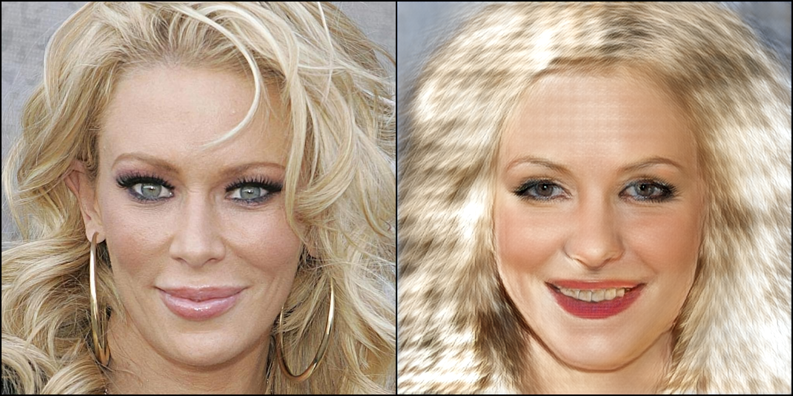
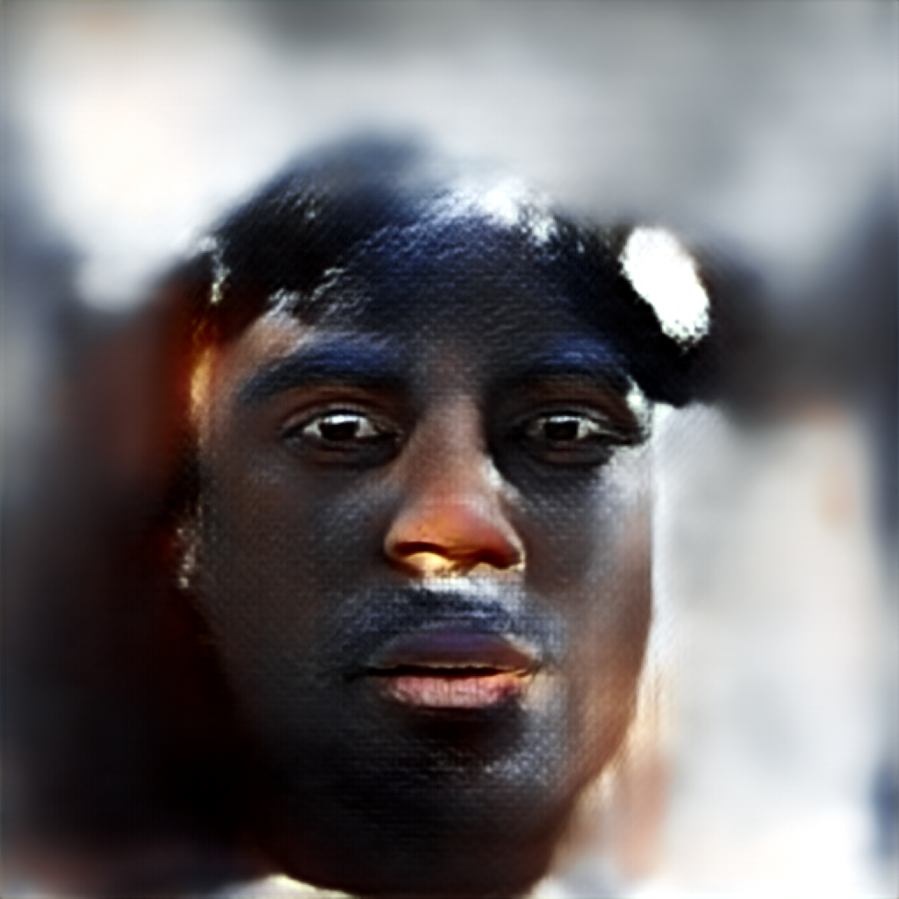
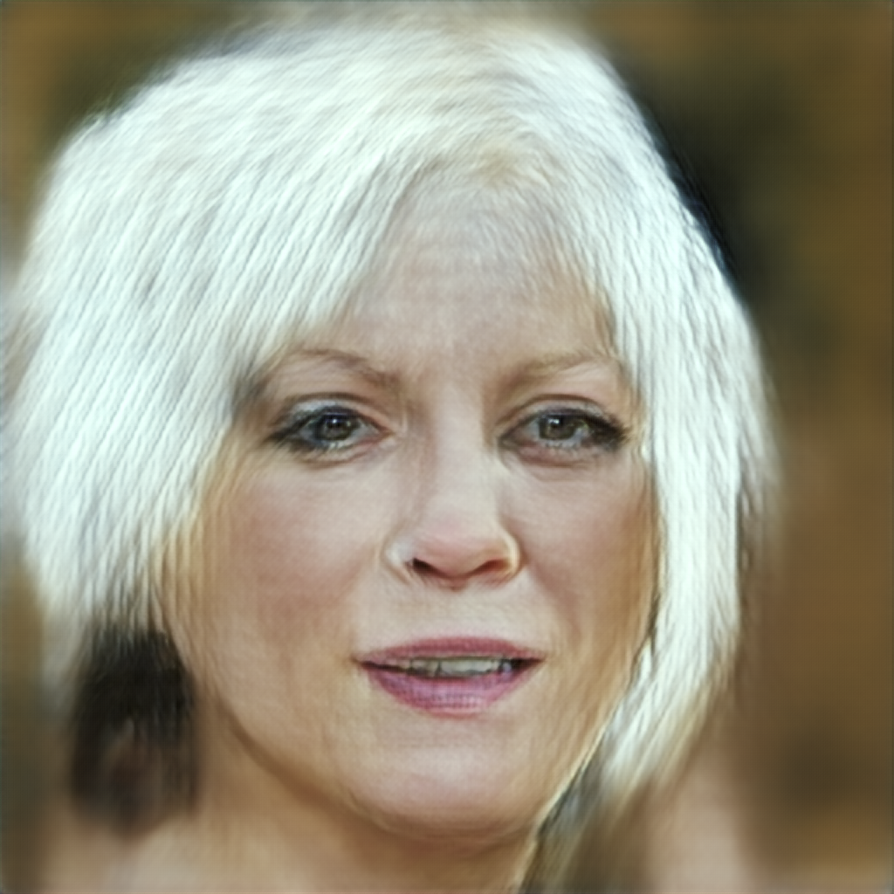
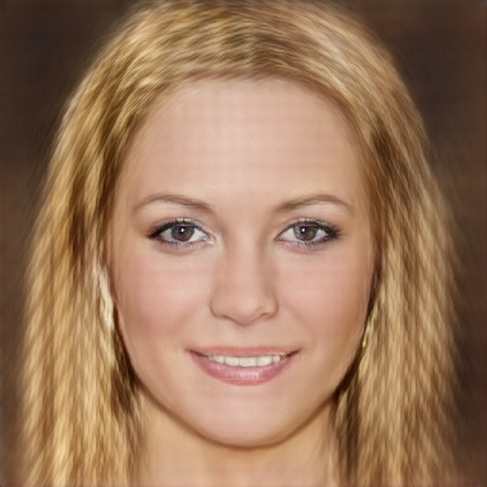
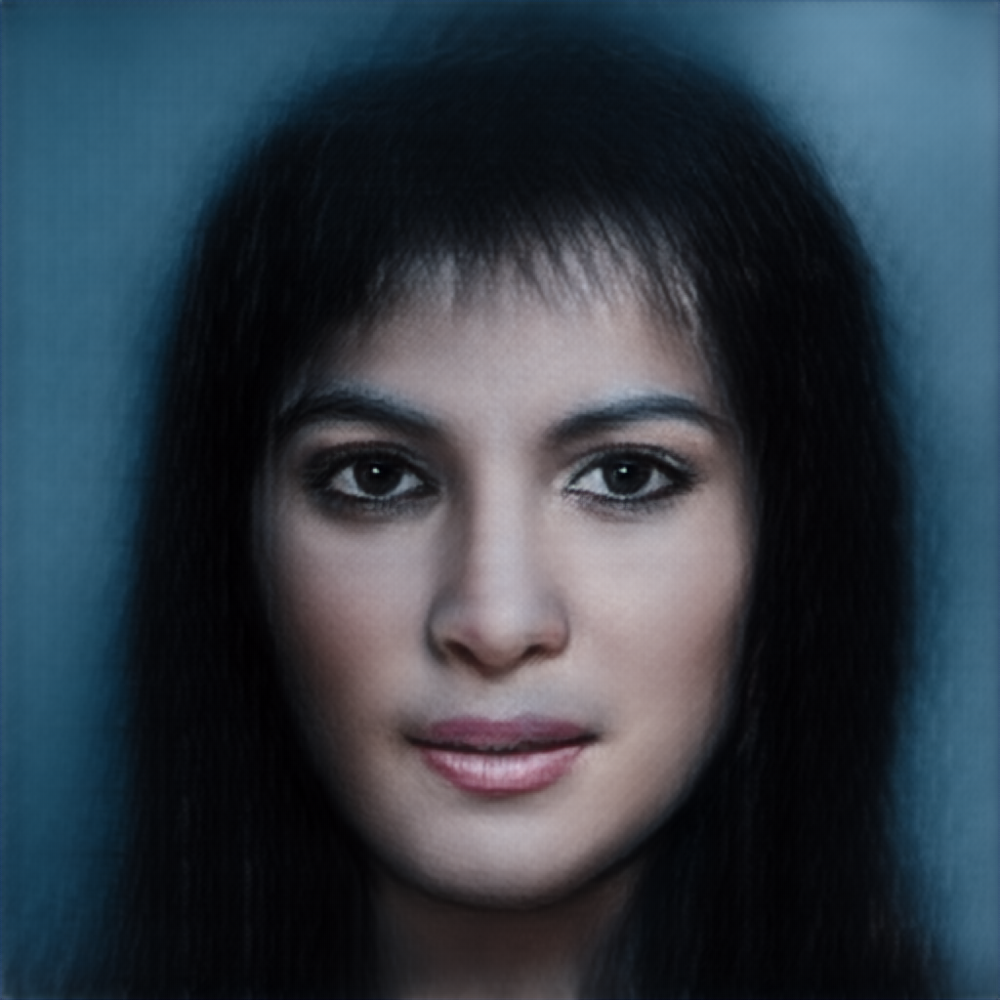
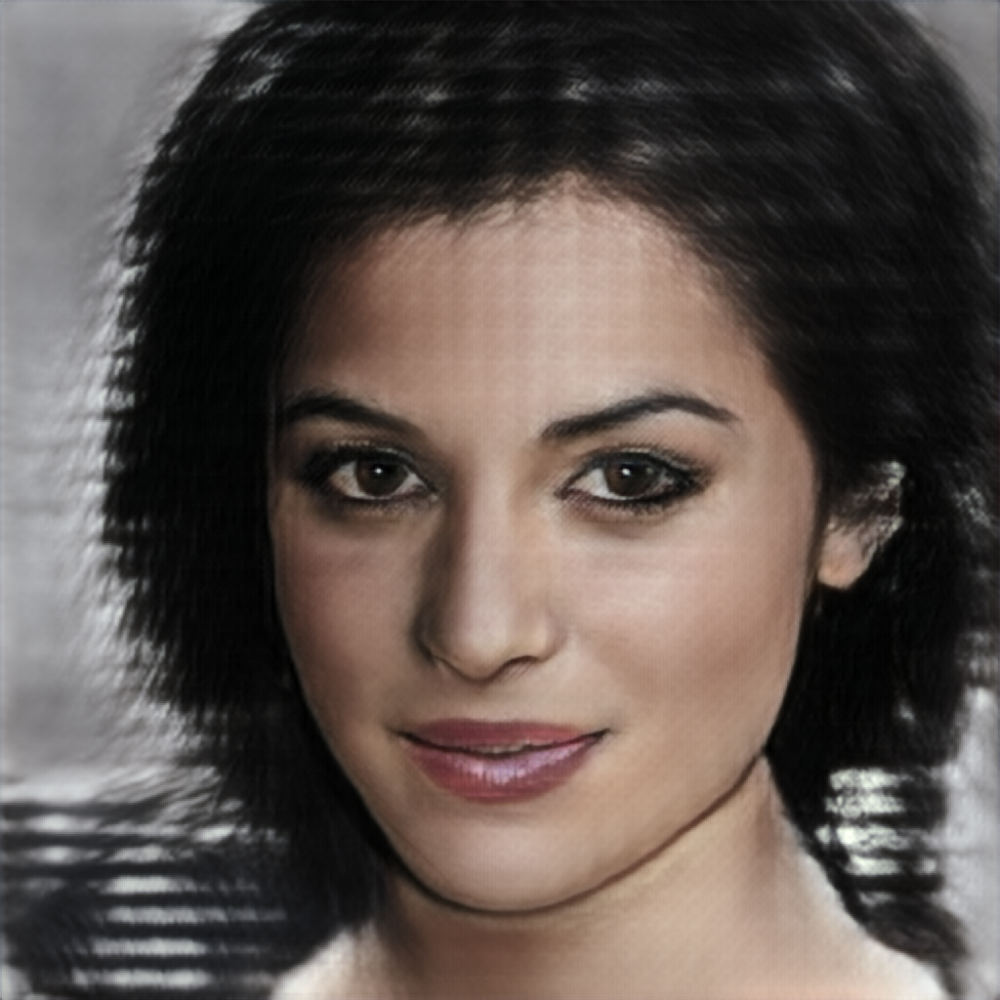

# CLIP2GAN：基于 CLIP 引导的图像生成模型

[](https://github.com/ricwyc-max/CLIP)

---

> **课程**：生成式人工智能  
> **状态**：已完成 exp1~exp6 消融实验，训练/测试流程已跑通  
> **指导老师**：陈培垠（pychen@hhu.edu.cn）  
> **成员邮箱**：134074852@qq.com  

---

## 1. 项目简介

本项目构建了一个 **文本到图像（Text-to-Image）** 生成模型。核心思路是利用 **CLIP（Contrastive Language-Image Pre-training）** 作为语义桥接器，将文本/图像编码到联合嵌入空间，再通过 **Bridge MLP** 将 CLIP 特征映射为 **MobileStyleGAN** 的 W+ 风格码，最终生成高保真图像。

**整体流程**：

```
原始图片 / 文本描述 → CLIP Encoder → 512维特征 → Bridge MLP → W+ latent code (23×512) → MobileStyleGAN → 1024×1024 图片
```

其中 CLIP 和 MobileStyleGAN 全程冻结，仅 Bridge MLP 参与训练。

---

## 2. 模型架构

### 核心流程图

```
┌─────────────────┐    512-dim     ┌──────────────┐    W+ (23×512)    ┌────────────────┐
│  CLIP Image     │───────────────▶│  Bridge MLP  │─────────────────▶│  MobileStyleGAN │
│  Text Encoder   │                │  (可训练)     │                  │  (冻结)          │
│  (冻结)          │                └──────────────┘                  │  SynthesisNet   │
└─────────────────┘                                                  └────────┬───────┘
                                                                              │
                                                                              ▼
                                                                    ┌─────────────────┐
                                                                    │  1024×1024 图像  │
                                                                    └─────────────────┘
```

### 组件说明

| 组件 | 模型 | 输出维度 | 是否训练 |
|------|------|---------|---------|
| 文本/图像编码器 | CLIP ViT-B-32（laion2b） | 512-d | ❌ 冻结 |
| 特征转换器 | Bridge MLP（12层全连接 + LeakyReLU + PixelNorm） | 23×512-d | ✅ **训练** |
| 图像生成器 | MobileStyleGAN MobileSynthesisNetwork | 1024×1024 | ❌ 冻结 |
| 判别器（Stage2-3） | MobileStyleGAN Discriminator | sigmoid | ✅ 训练 |

### 对比试验方案

本项目的最终方案为 **MobileStyleGAN + mobileCLIP（CLIP2GAN）**，以下为调研过的其他技术路线：

| 方案 | 生成器 | 引导方式 | 选用原因 |
|------|--------|---------|---------|
| CAFE-GAN / RATLIP | DCGAN | CLIP | 基线方案 |
| CLIP2GAN（**本项目**） | MobileStyleGAN | mobileCLIP | ✅ 轻量、效率高 |
| DALL·E 2 / DiffusionCLIP | Stable Diffusion | CLIP | 质量高但资源需求大 |
| UFOGen / clip2latent | Diffusion GAN | CLIP | 收敛快但实现复杂 |
| DALL·E | Transformer | CLIP | 开创性工作，计算成本高 |

---

## 3. 训练配置

### 训练设备与超参数

| 项目 | 配置 |
|------|------|
| GPU | NVIDIA GeForce RTX 4060 Laptop（8GB）（exp1~5，本地）</br>NVIDIA A100-PCIE-40GB（exp6，云端）|
| 框架 | PyTorch 2.7.1 + CUDA 11.8 |
| 数据集 | CelebA-HQ（30000 张 1024×1024 人脸图像） |
| 批次大小 | 8（梯度累积×4，等效 batch_size=32） |
| 总训练轮数 | 50 |
| 截断热身 | Stage1 前半段 psi 从 0.5 → 1.0 |

### 三阶段渐进训练（exp6）

| 阶段 | 目标 | L_rec | L_lpips | L_G | L_div | L_clip | L_reg | lr | lr_D |
|------|------|-------|---------|-----|-------|--------|-------|-----|------|
| Stage1（ep1-5） | 稳健基础人脸，不开判别器 | 1.0 | 0 | 0 | 0 | 5 | 0.005 | 1e-4 | 0 |
| Stage2（ep6-25） | 引入结构+对抗细节 | 1 | 1 | 1 | 0 | 1 | 0.01 | 5e-5 | 2e-5 |
| Stage3（ep26-50） | 精细打磨+多样性 | 1 | 1 | 1 | 1 | 1 | 0.01 | 2e-5 | 1e-5 |

阶段切换时权重线性插值过渡（`warmup_epochs=5`），避免损失突变。

### 损失函数

$$L_{total} = \lambda_{rec} L_{rec} + \lambda_{lpips} L_{lpips} + \lambda_G L_G + \lambda_{div} L_{div} + \lambda_{clip} L_{clip} + \lambda_{reg} L_{reg}$$

| 损失 | 公式 | 作用粒度 | 说明 |
|------|------|---------|------|
| L_rec | `MSE(x, x')` | **像素** | 逐像素重建，防止结构偏移 |
| L_lpips | AlexNet LPIPS | **感知** | 5层特征加权，补偿高频细节 |
| L_D | `-E[log D(x)] - E[log(1-D(x'))] + λ·GP` | **对抗** | WGAN-GP，单独优化判别器 |
| L_G | `E[log(1-D(x'))]` | **对抗** | 生成器骗过判别器 |
| L_div | `d_f / d_I` | **多样性** | 特征扰动 / 图像差异，防模式坍缩 |
| L_clip | `1 - cos(clip_real, clip_fake)` | **语义** | CLIP 空间余弦对齐 |
| L_reg | `mean(\|style\|)` | **约束** | W+ 码 L1 稀疏正则 |

**LPIPS 各层特征说明**：

| 层索引 | 输出通道 | 空间分辨率 | 捕获内容 |
|--------|----------|------------|---------|
| Layer 1 | 64 | 55×55 | 低级边缘、颜色、方向纹理 |
| Layer 4 | 192 | 27×27 | 纹理组合、角点、简单形状 |
| Layer 7 | 384 | 13×13 | 局部结构（眼、鼻等部件雏形） |
| Layer 9 | 256 | 13×13 | 高级语义特征、区域表示 |
| Layer 11 | 256 | 13×13 | 接近物体级别的判别信息 |

L_rec（像素）→ L_lpips（感知）→ L_clip（语义），三者从粗到细约束生成质量。

---

## 4. 测试结果

### mobileCLIP 基础测试

| 图片 | 说明 |
|------|------|
|  | mobileCLIP 零样本分类测试 |
|  | CLIP softmax 概率输出 |

### MobileStyleGAN 随机生成

| 随机种子输出 |
|-------------|
|    |
|    |

### CLIP2GAN 图像重生成

原图 → CLIP 编码 → Bridge MLP → StyleGAN 重生成：

| 原图 | 重生成结果 |
|------|-----------|
|  |  |

### CLIP2GAN 文生图

文本描述 → CLIP Text Encoder → Bridge MLP → StyleGAN 生成：

| 文本描述 | 生成结果 |
|----------|---------|
| a black man |  |
| a white young woman with a blonde hair and a green eyes |  |
| a make up woman with blonde curly hair red lips and a pair of dimple |  |
| a young beautiful woman with black straight hair and a blue eyes |  |
| detailed old man description (wrinkles, white hair, sunken eyes) |  |
| detailed young woman description (delicate face, bright eyes, dimples) |  |

| 文生图网格一览 |
|---------------|
|  |

---

## 5. 当前进度

- [x] 文献调研与方案选型
- [x] CLIP 预训练权重加载（本地离线缓存）
- [x] MobileStyleGAN 生成器集成
- [x] 封装 CLIP2GAN 统一接口
- [x] 损失函数模块（7种损失）
- [x] Bridge MLP 设计（12层，输出 23×512 W+ code）
- [x] 三阶段渐进训练（梯度累积 + 阶段平滑 + 截断热身）
- [x] 消融实验 exp1~exp6 全部完成（本地 RTX 4060 + 云端 A100）
- [x] 图像重生成 & 文生图推理测试
- [ ] 评估指标（FID、CLIP-Score）
- [ ] 文本到图像在线推理优化

---

## 6. 如何运行

### 环境安装

```bash
git clone [仓库地址]
cd CLIP
pip install -r requirements.txt
```

### 数据集准备

将 CelebA-HQ 图片放入 `dataset/CelebAMask-HQ/CelebAMask-HQ/CelebAMask-HQ/CelebA-HQ-img/` 目录。

### 训练

```bash
python training.py
```

训练产物输出到 `results/{exp_name}/`：
- `images/` — 每轮 batch 网格图 + 每 1000 张的单张生成图
- `checkpoints/` — `best_bridge.pth`（最佳权重）、`last_bridge.pth`（最终权重）
- `losses.csv` — 每轮损失记录
- `loss_curve.png` — 损失曲线图

### 推理测试

**PyCharm 直接运行**（推荐）：
```bash
# 修改 testing.py 顶部配置区的 BRIDGE_WEIGHT_PATH 后，右键 Run
python testing.py
```

**命令行模式**：
```bash
# 图像重生成测试
python testing.py --mode recon --weight results/exp6/checkpoints/best_bridge.pth

# 文生图测试
python testing.py --mode txt2img --weight results/exp6/checkpoints/best_bridge.pth
```

---

## 7. 项目架构

```text
CLIP
├── CLIP2GAN.py             统一封装类（CLIP + MobileStyleGAN）
├── bridgeNetwork.py         Bridge MLP（12层全连接，512→23×512）
├── lossFunction.py          损失函数模块（L_rec、L_D、L_G、LPIPS、L_div、L_clip、L_reg）
├── training.py              三阶段渐进训练
├── testing.py               PyCharm友好测试模块
├── LoadDatasets.py          数据集加载
├── CLIP/mobileCLIP/
│   ├── model/               CLIP 预训练权重（本地缓存）
│   └── openclip.py          CLIP 零样本测试
├── StyleGAN/mobileStyleGAN/MobileStyleGAN.pytorch/
│   ├── core/                模型定义（MappingNetwork、SynthesisNetwork、Discriminator）
│   └── model/               MobileStyleGAN 预训练权重
├── dataset/                 CelebA-HQ 数据集
├── results/                 训练产物（exp1~exp6）
├── test_results/            推理测试结果
└── docs/                    项目报告（Word + Markdown）
```

---

## 8. 团队分工

| 成员 | 职责 |
|------|------|
| **吴尧承** | CLIP 嵌入提取 & 损失函数模块、Bridge MLP 设计、生成器架构集成 & 数据处理、训练流程调试 & 消融实验运行（exp1~6） |
| **刘健韬** | 研究背景 & 技术逻辑梳理、材料整合、结题报告撰写 |

---

## 依赖

主要依赖 `open_clip_torch`、`torch`、`torchvision`、`pillow`、`numpy`、`matplotlib`、`opencv-python` 等。完整列表见 [`requirements.txt`](./requirements.txt)。

<details>
  <summary>📂 点击展开完整依赖</summary>

```text
Package                   Version
------------------------- ------------
addict                    2.4.0
aiohappyeyeballs          2.6.1
aiohttp                   3.13.5
aiosignal                 1.4.0
annotated-doc             0.0.4
anyio                     4.12.1
arrow                     1.4.0
async-timeout             5.0.1
attrs                     26.1.0
beautifulsoup4            4.14.3
boto3                     1.42.97
botocore                  1.42.97
bravado                   11.1.0
bravado-core              6.3.1
cattrs                    25.3.0
certifi                   2026.4.22
charset-normalizer        3.4.7
click                     8.1.8
colorama                  0.4.6
coremltools               9.0
exceptiongroup            1.3.1
filelock                  3.19.1
fqdn                      1.5.1
frozenlist                1.8.0
fsspec                    2025.10.0
ftfy                      6.3.1
future                    1.0.0
gdown                     5.2.2
gitdb                     4.0.12
GitPython                 3.1.49
h11                       0.16.0
hf-xet                    1.4.3
httpcore                  1.0.9
httpx                     0.28.1
huggingface_hub           1.8.0
idna                      3.13
importlib_resources       6.5.2
isoduration               20.11.0
Jinja2                    3.1.6
jmespath                  1.1.0
jsonpointer               3.0.0
jsonref                   1.1.0
jsonschema                4.25.1
jsonschema-specifications 2025.9.1
kornia                    0.8.2
kornia_rs                 0.1.10
lark                      1.3.1
lightning-utilities       0.15.2
markdown-it-py            3.0.0
MarkupSafe                3.0.2
mdurl                     0.1.2
monotonic                 1.6
mpmath                    1.3.0
msgpack                   1.1.2
multidict                 6.7.1
neptune-client            1.14.0.post2
networkx                  3.2.1
ninja                     1.13.0
numpy                     2.0.2
oauthlib                  3.3.1
open_clip_torch           3.3.0
opencv-python             4.13.0.92
packaging                 26.2
pandas                    2.3.3
pillow                    11.3.0
pip                       26.0.1
piq                       0.8.0
propcache                 0.4.1
protobuf                  6.33.6
psutil                    7.2.2
pyaml                     26.2.1
Pygments                  2.20.0
PyJWT                     2.12.1
PySocks                   1.7.1
python-dateutil           2.9.0.post0
pytorch-fid               0.3.0
pytorch-lightning         2.6.0
pytorch_wavelets          1.3.0
pytz                      2026.1.post1
PyWavelets                1.6.0
PyYAML                    6.0.3
referencing               0.36.2
regex                     2026.1.15
requests                  2.32.5
requests-oauthlib         2.0.0
rfc3339-validator         0.1.4
rfc3986-validator         0.1.1
rfc3987-syntax            1.1.0
rich                      15.0.0
rpds-py                   0.27.1
s3transfer                0.16.1
safetensors               0.7.0
scipy                     1.13.1
setuptools                80.9.0
shellingham               1.5.4
simplejson                4.1.1
six                       1.17.0
smmap                     4.0.3
soupsieve                 2.8.3
swagger-spec-validator    3.0.4
sympy                     1.14.0
timm                      1.0.26
torch                     2.7.1+cu118
torchaudio                2.7.1+cu118
torchmetrics              1.8.2
torchvision               0.22.1+cu118
tqdm                      4.67.3
typer                     0.23.2
typing_extensions         4.15.0
tzdata                    2026.2
uri-template              1.3.0
urllib3                   1.26.20
wcwidth                   0.6.0
webcolors                 24.11.1
websocket-client          1.9.0
wheel                     0.47.0
yarl                      1.22.0
zipp                      3.23.1
```
</details>

---

## Citing

```bibtex
@software{ilharco_gabriel_2021_5143773,
  author       = {Ilharco, Gabriel and Wortsman, Mitchell and Wightman, Ross and others},
  title        = {OpenCLIP},
  month        = jul, year = 2021,
  publisher    = {Zenodo}, version = {0.1},
  doi          = {10.5281/zenodo.5143773}
}

@inproceedings{cherti2023reproducible,
  title={Reproducible scaling laws for contrastive language-image learning},
  author={Cherti, Mehdi and Beaumont, Romain and Wightman, Ross and others},
  booktitle={CVPR}, pages={2818--2829}, year={2023}
}

@inproceedings{Radford2021LearningTV,
  title={Learning Transferable Visual Models From Natural Language Supervision},
  author={Alec Radford and Jong Wook Kim and Chris Hallacy and others},
  booktitle={ICML}, year={2021}
}

@misc{belousov2021mobilestylegan,
  title={MobileStyleGAN: A Lightweight Convolutional Neural Network for High-Fidelity Image Synthesis},
  author={Sergei Belousov}, year={2021},
  eprint={2104.04767}, archivePrefix={arXiv}
}
```
